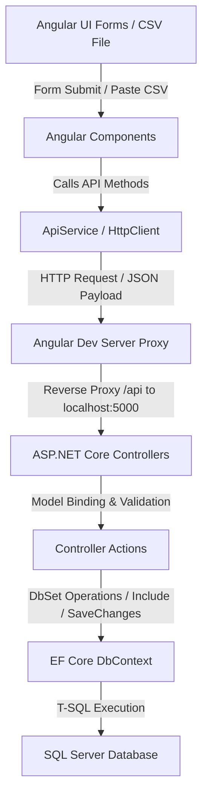

# Project Tracking App - Context & Architecture

This document serves as the source of truth for the codebase architecture, data flows, design patterns, and tech stack inventory of the **Project Tracking App**.

---

## 1. Current State

The **Project Tracking App** is a centralized system for tracking humanitarian, medical, and outreach projects, their participants, and their quantitative impact metrics (outputs) across various locations and ships.

### Core Entities & Domain Model
The database schema consists of three logical groups:

1. **Lookup / Reference Tables**
   - `Country` & `City`: Geospatial references mapping locations.
   - `Ship`: Active vessels supporting outreach operations (e.g., *Global Mercy*, *Africa Mercy*) or land-based setups.
   - `ProgramName`: Program areas (e.g., *Ophthalmic (Eye) Surgery*, *Medical Capacity Building (MCB)*).
   - `ProjectType`: Structural types of projects (e.g., *Surgical Outreach*, *Clinical Training Course*).
   - `ParticipantType`: Operational specialties of participants (e.g., *Surgeon / Doctor*, *Registered Nurse*).
   - `OutputType` & `SpecificOutputType`: Categorized metrics that measure project output (e.g., category: `"Patient"`, type: `"Surgeries Performed"`, specific: `"Cataract Surgery"`).
   - `FinanceCode`: Financial accounting dimensions classified by Location, Program, or Purpose codes (e.g., `LOC-SEN-DKR`, `PGM-EYE-CARE`, `PUR-TRN-NURS`).
   - `Institution`: Facilities/hospitals associated with participants.

2. **Core Registries**
   - **`Project`**: The central record for an outreach event. Tracks metadata, timelines, instruction days, location, comments, and the three finance codes (Location, Program, Purpose).
   - **`Participant`**: Individual registry for trainees, specialists, and professionals, tracking contact details, institution, profession, and country.

3. **Bridge / Output Tables (Impact Logging)**
   - **`ProjectParticipantOutput`**: Logs training metrics (e.g., hours/days) when a participant attends a project.
   - **`PatientOutput`**: Logs aggregated, anonymized patient-level impacts (e.g., surgery counts, screening counts) sliced by gender, age group, and location of residence.
   - **`DmsInfrastructureOutput`**: Logs infrastructure and physical assets distributed (e.g., equipment donations) sliced by target demographics.
   - **`PlannedOutput`**: Stores project-specific target metrics (Planned Amount) per output type to measure performance against goals.

### Implemented Features
- **Dashboard & KPIs**: Calculates and showcases KPIs (Total Projects, Active Projects, Total Participants, Total Patient Outputs, Total Training Hours). Displays interactive charts (Outputs by Year, Country, Program) via Chart.js.
- **Data Auditing & Warnings**: Audits database integrity and surfaces warnings on the dashboard:
  1. Completed projects with no outputs logged.
  2. Projects missing one or more required financial codes.
  3. Participants missing both email and phone contact details.
- **Registry CRUD Panels**: Complete listing interfaces for Projects and Participants featuring advanced search, lookup-driven filters, pagination, and forms to add/modify details.
- **Detailed Analytics Tabulation**: The Project Detail view calculates actual performance vs planned targets (as percentages) and hosts sub-tabs to manage all associated participant, patient, DMS, and target output entries.
- **Dedicated Output Entry**: A unified entry form (`/output-entry`) to log outputs across all categories for any given project.
- **Bulk CSV Import**: An administration panel for batch uploading Projects and Participants. It provides:
  - Header validation and lookup resolution.
  - Verification warnings (e.g. mapping lookups) and validation errors.
  - Duplicate detection to allow existing rows to be safely updated.
  - Dynamic registry of missing lookup entries (such as `Institution` records) during commit.
  - Lookup tables editing interface to create new references on-the-fly.
- **Mock Access Control**: Role-based routing and action restriction (`admin` = full access + user management, `reporter` = write/logging access, `viewer` = read-only access).

---

## 2. Active Data Flow

Data travels from the client interface down to the SQL Server database through the following lifecycle:

### Flow Breakdown

1. **User Interaction & Client State**:
   - For standard additions (e.g., logging a patient output), the user submits an Angular form.
   - For imports, a `FileReader` reads the local CSV file as a raw text string, which is submitted as a JSON payload: `{ csvData: string }`.

2. **API Client & Proxy**:
   - The Angular UI invokes helper functions inside [api.service.ts](file:///c:/Git%20Repo/project-tracking-app/frontend/src/app/services/api.service.ts).
   - Local requests target `/api/...`. The dev server's proxy configuration ([proxy.conf.json](file:///c:/Git%20Repo/project-tracking-app/frontend/proxy.conf.json)) redirects these calls to the ASP.NET Core backend (running at the configured HTTP port, e.g., `http://localhost:5000` or `https://localhost:7119`).

3. **Controller Handling & Validation**:
   - Incoming requests are handled by specific controllers in `backend/Controllers`.
   - `ImportController` separates bulk operations into two steps:
     - `/validate`: Parses raw CSV, validates mandatory columns, checks reference lookups, flags duplicates, and returns validation status without writing to the database.
     - `/commit`: Receives the validated rows and applies changes to the database inside an database transaction.

4. **Entity Framework Core (ORM) & Database execution**:
   - The controllers interact with the database via `ProjectTrackingContext`.
   - Eager loading (`.Include()`, `.ThenInclude()`) is used to resolve navigation properties (such as mapping a Project back to its Program or Country).
   - Entity additions, modifications, or deletions are queued in the context and executed as a batch SQL statement upon invoking `SaveChangesAsync()`.
   - The underlying database engine is **Microsoft SQL Server**, executing relational operations against a database named `ProjectTrackingDb`.

---

## 3. Core Architectural Rules

### Frontend Design Rules (Angular)
- **Standalone Architecture**: Components are standalone and declare their imports explicitly (e.g., `CommonModule`, `FormsModule`, `RouterLink`).
- **State Management**: Mock session state and active user management are handled using Angular **Signals** (`currentUserSignal`, `usersSignal`) in `AuthService`.
- **Data Visualization**: Chart.js is integrated directly via HTML5 `<canvas>` elements and initialized in the component code (`new Chart()`) instead of using heavy third-party Angular wrapper libraries.
- **Client-Side Security**: Views display or hide UI elements based on the current user's role helpers (`isAdmin()`, `hasWriteAccess()`).

### Backend Design Rules (ASP.NET Core / EF Core)
- **Controller-Based Routing**: Clean separating of concerns through standard `[ApiController]` and attributes routing (`api/[controller]`).
- **Bidirectional JSON Serialization**: To prevent infinite JSON reference loops when serializing bidirectional navigation properties (e.g., `Project` contains `ParticipantOutputs`, which refers back to `Project`), serializer options are customized in [Program.cs](file:///c:/Git%20Repo/project-tracking-app/backend/Program.cs):
  - `ReferenceHandler.IgnoreCycles`
  - `DefaultIgnoreCondition = JsonIgnoreCondition.WhenWritingNull`
- **Restrictive Referential Integrity**: EF Core is configured to use `DeleteBehavior.Restrict` for all foreign key relationships (defined in `ProjectTrackingContext.OnModelCreating`). This prevents SQL Server from raising errors regarding multiple cascade delete paths.
- **Transaction Safety**: Bulk imports (`ImportController`) and cascading deletions wrap multiple DB context operations in explicit database transactions (`BeginTransactionAsync()`) to guarantee atomicity.
- **Automatic Migration & Seeding**: The backend applies any outstanding EF migrations and runs lookup seeder routines (`DbSeeder.Seed`) automatically upon startup.

---

## 4. Tech Stack Inventory

### Frontend Dependencies (`frontend/package.json`)
- **Framework**: Angular v21.2.0 (Core, Common, Compiler, Forms, Router, Platform-Browser)
- **Asynchronous/Reactive Utilities**: RxJS v7.8.0
- **Charts / Visualization**: Chart.js v4.5.1
- **Testing Runner**: Vitest v4.0.8 & JSDOM v28.0.0
- **Styling**: Vanilla CSS

### Backend Dependencies (`backend/backend.csproj`)
- **Runtime**: .NET 10.0
- **Web API Engine**: Microsoft.AspNetCore.App
- **Database Engine**: Microsoft SQL Server
- **ORM / Data Access**:
  - `Microsoft.EntityFrameworkCore` v10.0.0
  - `Microsoft.EntityFrameworkCore.SqlServer` v10.0.0
  - `Microsoft.EntityFrameworkCore.Design` v10.0.0
  - `Microsoft.Data.SqlClient` v9.0.0
- **API Documentation / OpenAPI**:
  - `Microsoft.AspNetCore.OpenApi`
  - `Swashbuckle.AspNetCore`
