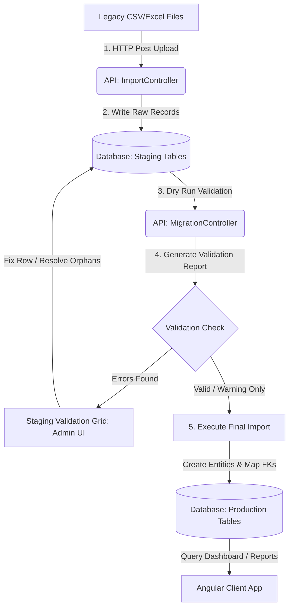

# Product Requirements & Design Document (PRDD)
## NGO Project & Participant Tracking System

> [!NOTE]
> This document is designed as a living collaborative specification. Please feel free to add comments, propose changes via pull requests, or update sections as the product evolves.

---

## 1. Executive Summary & Objectives
The **NGO Project & Participant Tracking System** is a unified data migration, verification, and program management platform. It is built to resolve a major operational challenge: consolidating legacy Excel spreadsheets and CSV files containing years of disconnected NGO projects, participant data, and output metrics into a robust, structured, relational database.

### Core Objectives
* **Consolidate Legacy Data**: Provide an automated mechanism to parse, map, and import historical spreadsheets.
* **Guarantee Data Integrity**: Check incoming records against a rigorous validation engine (dry run) that catches errors, highlights warnings, and handles duplicates before any database writes occur.
* **Monitor Programmatic Impact**: Offer dashboards, project detail views, and output trackers to follow the progress of NGO programs.
* **Streamline NGO Operations**: Enable staff to track participants, link them to projects, input new outputs, and run custom, exportable reports.

---

## 2. System Architecture & Data Flow
The system uses a staging area design pattern. Data is never imported directly into final operational tables; it is first written to **Staging Tables**, validated, corrected if necessary, and then migrated to **Production Tables**.



### Technology Stack
* **Frontend**: Angular (v21.2.x) SPA, Chart.js for data visualization, Tailwind CSS or Vanilla CSS for sleek styling, proxy configuration for local development.
* **Backend**: ASP.NET Core Web API (.NET 10), Entity Framework Core (EF Core) with SQL Server database provider.
* **Database**: SQL Server (LocalDB in Development, Standard SQL Server in Staging/Production).

---

## 3. Product & System Requirements

### 3.1 Data Staging & Validation Requirements
* **Flexible Column Mapping**: The CSV parser must dynamically map common spelling variations for header rows (e.g. `project_id_number`, `project id`, `Project Code` should all map to the same field).
* **Validation Categories**:
  * `Error`: Structural issues (e.g., missing unique identifier, unparseable dates, critical mismatch). Mute rows from final import.
  * `Warning`: Non-critical anomalies (e.g., missing project title, new country or ship that does not exist in standard reference tables). These do not prevent import; the system auto-creates missing reference lookup items.
  * `Duplicate`: Identifies duplicate IDs within the current upload batch or against already-imported data.
* **Orphan Detection**: Detect records referencing projects or participants that haven't been imported yet, enabling administrators to resolve them before final import.

### 3.2 Program Management Requirements
* **Project Directory**: Grid layout with text searches, filter by Program Type, Ship, and Country, and support for Excel exports.
* **Project Details View**: Detail page displaying linked participants, finance code coverage status, and output history.
* **Participant Directory**: Directory with contact information search, linked project tables, and filters.
* **Reference Data Admin**: Support auto-generation and manual linking of:
  * Countries & Cities
  * Ships (Active vs. Inactive)
  * Finance Codes (Location, Program, Purpose)
  * Program Names & Project Types

### 3.3 Reporting & Analysis Requirements
* **Interactive Dashboard**: KPI summaries showing totals of active projects, participants, and outputs. Interactive charts showing outputs by country/ship over time.
* **Report Generator**: Advanced filter panel allowing reporting queries based on custom date ranges, ship names, or country locations.
* **Excel Exporting**: Direct download of generated report tables to Excel format.

---

## 4. User Roles & Use Cases

The system defines three core user roles based on authorization and operational needs:

| User Role | Main Goal | Key Responsibilities |
| :--- | :--- | :--- |
| **System Administrator / Migration Lead** | Ensure clean historical database migration. | Bulk CSV uploads, dry-run validations, resolving staging errors, and executing imports. |
| **Program Manager / Project Coordinator** | Day-to-day operations and logging. | Creating/editing projects, assigning participants, mapping finance codes, entering output logs. |
| **NGO Director / Executive Officer** | Assess overall impact and strategic metrics. | Viewing dashboard statistics, auditing financial mappings, generating and downloading reports. |

### 4.1 Use Case Details

#### Use Case 1: Import Legacy Excel Data
* **Actor**: System Administrator
* **Trigger**: A new spreadsheet of historical projects needs to be imported.
* **Flow**:
  1. Admin navigates to the **Import Admin** screen.
  2. Selects the file and clicks **Upload**.
  3. The API writes records to the `StagingProjects` table and initiates a validation pass.
  4. The screen displays a **Validation Report** indicating row validity, warnings, and errors.
  5. Admin resolves any staging errors or triggers the final import.
  6. The backend translates valid rows into permanent `Project` entities, resolves foreign key lookups, and flags the staging rows as `IsProcessed = true`.

#### Use Case 2: Record Specific Project Outputs
* **Actor**: Program Manager
* **Trigger**: A project has completed a session and outputs need to be logged.
* **Flow**:
  1. User navigates to **Output Entry**.
  2. Selects the Project and specifies the Output Type (e.g., Participant Output, Patient Output, or DMS Infrastructure Output).
  3. Fills in reporting period, date, amount, and comments.
  4. System updates the database and automatically recalculates the project details and dashboard metrics.

#### Use Case 3: Review Programmatic Finance Coverage
* **Actor**: NGO Director
* **Trigger**: Monthly audit of financial allocation tracking.
* **Flow**:
  1. Director views the **Dashboard** or **Projects List**.
  2. Filters by "Missing Finance Codes" or reviews the warnings.
  3. System flags projects missing Location, Program, or Purpose codes.
  4. Director assigns correct financial ledger codes to guarantee precise funding reports.

---

## 5. Development Roadmap & Timeline
Below is the timeline mapping past and future phases of development:

```
[Phase 1: Database Design] ──> [Phase 2: CSV & Staging] ──> [Phase 3: Validation Engine] ──> [Phase 4: SPA Frontend] ──> [Phase 5: Output & Dashboards] ──> [Phase 6: Reports & Export] ──> [Phase 7: Sharing & UAT]
    (Completed)                     (Completed)                   (Completed)                   (Completed)                    (Completed)                    (Completed)                   (CURRENT)
```

### Phase Schedule

```gantt
    title NGO Project Tracking Development Timeline
    dateFormat  YYYY-MM-DD
    section Backend Core
    Db Schema & Models (Phase 1)        :done,    p1, 2026-01-01, 2026-01-20
    Staging & CSV Parser (Phase 2)      :done,    p2, 2026-01-21, 2026-02-15
    Validation & Seed Engine (Phase 3)   :done,    p3, 2026-02-16, 2026-03-15
    section Client UI
    Angular UI Routing & Setup (Phase 4):done,    p4, 2026-03-16, 2026-04-10
    Output Entry & Dashboards (Phase 5) :done,    p5, 2026-04-11, 2026-05-10
    Excel Reporting & Prints (Phase 6)  :done,    p6, 2026-05-11, 2026-06-05
    section UAT & Deployment
    External Network Testing (Phase 7)   :active,  p7, 2026-06-06, 2026-06-30
    Production Release                   :         p8, 2026-07-01, 2026-07-15
```

### Current Status (Phase 7: Sharing & User Acceptance Testing)
> [!IMPORTANT]
> We are currently validating local instances on mock datasets. 
> To test with team members on separate networks, we have established a Cloudflare Tunnel forwarding the Angular frontend server on port `4200` to the internet.
> 
> * **Immediate Next Steps**: 
>   1. Provide the Cloudflare tunnel URL to testing coordinators.
>   2. Collect feedback on dry-run spreadsheet upload usability.
>   3. Finalize database constraint adjustments before launching production servers.
